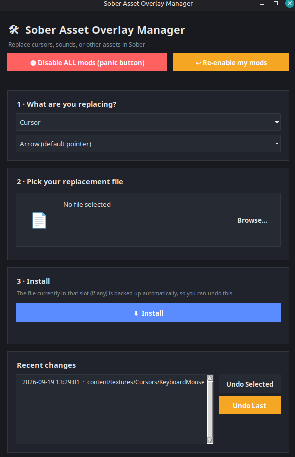

# Sober Asset Overlay Manager

A small desktop app for installing custom cursors, sounds, or other
replaceable assets into **Sober**, the Linux Roblox client by
[VinegarHQ](https://vinegarhq.org) — with automatic backups, per-change
undo, and a one-click panic button if a mod breaks something.



## Why

Sober lets you override game assets using its [asset overlay
system](https://vinegarhq.org/Sober/Configuration/TipsAndTricks.html), but
it means recreating a specific nested folder structure and knowing the
exact filenames Roblox expects — and there's no built-in way to undo a
change if it breaks something. This tool handles the folder/file mechanics
and adds safety nets on top.

## Features

- **Cursors** — install a PNG as any of Sober's known cursor slots (arrow,
  far arrow, I-beam) or a custom filename
- **Sounds** — replace known sound files, or specify your own
- **Custom path (advanced)** — replace *any* overlay-able asset by typing
  its exact path relative to `asset_overlay/` (see [Finding asset
  filenames](#finding-asset-filenames) below)
- **Automatic backups** — whatever was previously in that slot (if
  anything) is backed up before being overwritten
- **Undo** — revert your last change, or any specific past change, from
  the history list
- **Panic button** — instantly disables *every* active override at once by
  moving the whole overlay folder aside, in case a mod softlocks the game
  or breaks something. Nothing is deleted — one click brings it all back
- Warns you if it can't find a Sober installation, instead of failing
  silently
- Dark UI, no external dependencies beyond Python + tkinter (+ optional
  Pillow for image previews)

## Requirements

- Linux (Sober is Linux-only, distributed via Flatpak)
- [Sober](https://vinegarhq.org) installed and launched at least once
- Python 3
- `tkinter`
- `Pillow` (optional, only used for the image preview thumbnail)

## Install & Run

```bash
git clone https://github.com/Space-Raler/sober-asset-manager.git
cd sober-asset-manager

# tkinter (if not already installed)
sudo apt install python3-tk       # Debian/Ubuntu
sudo dnf install python3-tkinter  # Fedora
sudo pacman -S tk                 # Arch

# optional, for image preview
pip install --user -r requirements.txt

python3 sober_asset_manager.py
```

## Usage

1. Pick a category: **Cursor**, **Sound**, or **Custom path** for anything
   else.
2. Choose a known slot, or type the filename/path yourself.
3. Browse for your replacement file.
4. Click **Install**.
5. Fully quit and reopen Sober — asset overlay files only load on launch.

Every install is logged in **Recent changes**, where you can undo any
individual change (restoring whatever was there before, or removing the
override entirely if nothing was).

### If something breaks

Click **⛔ Disable ALL mods (panic button)**. This moves your entire
overlay folder aside so Sober loads with 100% stock assets — nothing is
deleted. Once you've sorted out which mod was the problem, click **↩
Re-enable my mods** to bring everything back.

### Finding asset filenames

Roblox doesn't publish an official list of its internal asset filenames,
and only a couple (like the death sound, `ouch.ogg`) are confirmed by
VinegarHQ's own docs — everything else varies by client version and isn't
reliably documented anywhere.

Rather than guess, this tool includes a built-in **🔍 Find asset...**
search: Sober stores the downloaded Roblox client as `.apk` files under
`~/.var/app/org.vinegarhq.Sober/data/sober/packages/` — since an APK is
just a ZIP archive, this tool opens them directly and lists every asset
file packed inside, so you can search/filter by name to find the *actual
current* filename for whatever you want to replace — jump sounds,
footsteps, UI clicks, background music, whatever's in there — instead of
relying on a stale or wrong guess.

To use it: switch to **Custom path (advanced)** (or pick "Custom
filename..." in the Cursor/Sound dropdowns), click **Find asset...**,
and search. Double-click a result (or select it and click "Use Selected")
to fill in the path automatically.

Note: this only searches assets for games you've actually opened in Sober
at least once, since that's what triggers the download. Filenames can also
change between Roblox client updates, so a path that works today may need
rechecking later.

### Image size for cursors

VinegarHQ doesn't publish an official size requirement for cursor overlay
images, so treat this as general convention rather than a documented
Sober rule:

- **32×32 px** is the standard size most operating systems and game
  engines use for cursor images, and is a safe default
- **16×16 px** also works in most cursor systems, if you want a smaller
  pointer
- Square images are expected — non-square or very large images (e.g.
  256×256) may get scaled oddly or not render as intended, since cursor
  systems generally assume a small square texture
- PNG with transparency (alpha channel) is supported and recommended for
  non-rectangular cursor shapes

If a cursor you install doesn't show up right, resizing it down to a
clean 32×32 (or 16×16) square PNG is the first thing to try.

Installed/overridden files live at:

```
~/.var/app/org.vinegarhq.Sober/data/sober/asset_overlay/
```

Backups and change history created by this tool live separately at:

```
~/.local/share/sober-asset-manager/
```

## Notes

- Overlay changes apply globally across every experience in Sober, not
  per game.
- This is an unofficial, community tool — not affiliated with VinegarHQ,
  Sober, or Roblox Corporation.

## Contributing

Issues and pull requests are welcome — more known cursor/sound slots,
distro packaging, etc. are all fair game.

## License

[MIT](LICENSE)
